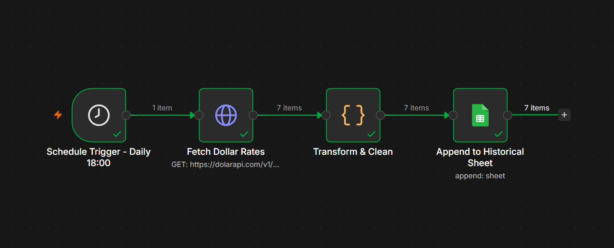
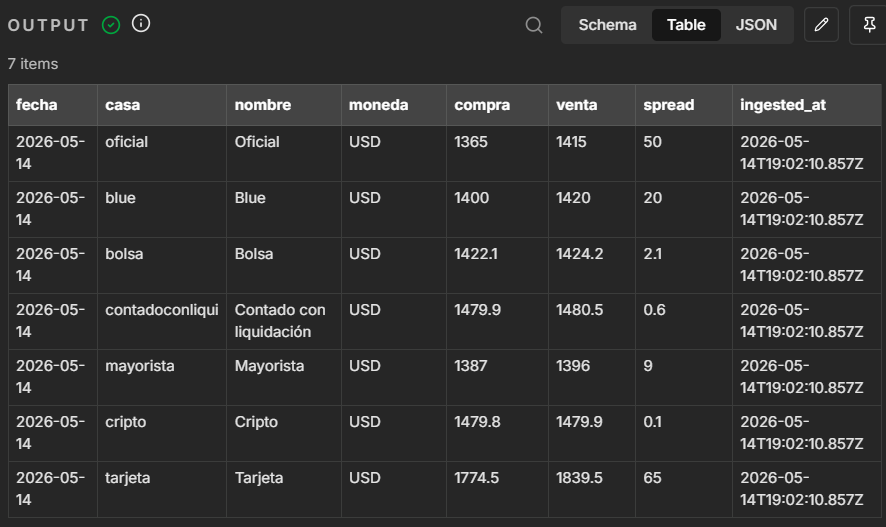

# Argentina Dollar Rates - Data Pipeline


> Automated ETL pipeline built in **n8n** that collects Argentine dollar exchange rates daily, transforms them into clean analysis-ready records, and appends them to a historical dataset in Google Sheets. Over time it builds a growing time series with zero manual effort.

---

## Why This Project

This pipeline is the **data acquisition layer** of a complete data lifecycle. Most analytics projects start from a dataset that already exists; this one *creates* the dataset by automating its collection.

Argentina has multiple parallel dollar exchange rates (official, blue, MEP, CCL, etc.) that fluctuate daily and are widely tracked. There is no single public historical dataset that consolidates them cleanly, so this pipeline builds one.

---

## Architecture

The workflow follows a standard **Extract -> Transform -> Load** pattern:

```
+---------------------+    +-------------------+    +-----------------+    +----------------------+
|  Schedule Trigger   | -> |   HTTP Request    | -> |   Code (JS)     | -> |   Google Sheets      |
|  Daily at 18:00     |    |  GET dolarapi.com |    |  Transform/Clean|    |  Append rows         |
+---------------------+    +-------------------+    +-----------------+    +----------------------+
       trigger                  EXTRACT                TRANSFORM                  LOAD
```

| Node | Type | Responsibility |
| --- | --- | --- |
| **Schedule Trigger** | Schedule Trigger | Fires the workflow every day at 18:00 |
| **Fetch Dollar Rates** | HTTP Request | `GET https://dolarapi.com/v1/dolares` returns all dollar types in one call |
| **Transform & Clean** | Code (JavaScript) | Builds one clean row per dollar type, computes the buy/sell spread, adds an ingestion timestamp |
| **Append to Historical Sheet** | Google Sheets | Appends the transformed rows to a Google Sheet, growing the historical dataset |

---

## Workflow Preview

Screenshots of the workflow canvas in the n8n editor.




---

## Output Data Dictionary

Each pipeline run appends one row per dollar type to the destination sheet:

| Column | Type | Description |
| --- | --- | --- |
| `fecha` | date | Quote date (from the API `fechaActualizacion`) |
| `casa` | string | Dollar type code (oficial, blue, mep, ccl, cripto, tarjeta, mayorista) |
| `nombre` | string | Human-readable dollar type name |
| `moneda` | string | Currency (USD) |
| `compra` | number | Buy price (ARS) |
| `venta` | number | Sell price (ARS) |
| `spread` | number | Computed difference between sell and buy price |
| `ingested_at` | timestamp | ISO timestamp of when the pipeline collected the record |

---

## Data Source

- **API:** [dolarapi.com](https://dolarapi.com) - free public API for Argentine exchange rates
- **Endpoint:** `GET /v1/dolares`
- **Authentication:** none required
- **Update frequency:** the source refreshes multiple times per business day

---

## Setup

See [docs/SETUP.md](docs/SETUP.md) for full step-by-step instructions on:

1. Installing n8n (cloud or self-hosted)
2. Importing the workflow from [`workflow/argentina_dollar_etl.json`](workflow/argentina_dollar_etl.json)
3. Creating the destination Google Sheet
4. Connecting Google Sheets credentials (OAuth)
5. Testing and activating the workflow

---

## Repository Structure

```
argentina-dollar-data-pipeline/
| workflow/
|   argentina_dollar_etl.json     n8n workflow (importable)
| docs/
|   SETUP.md                      Step-by-step setup guide
|   screenshots/                  Workflow canvas screenshots
| README.md
```

---

## Possible Extensions

- Add inflation and country-risk indicators from additional public APIs
- Add a conditional alert node (notify when a rate moves beyond a threshold)
- Add a data-quality check node before the load step
- Connect the resulting dataset to a Power BI or Streamlit dashboard for visualization

---

## Author

Agustin Lannoo, Data Analyst & BI Engineer

- LinkedIn: https://www.linkedin.com/in/agustin-lannoo/
- GitHub: https://github.com/Alannoo6
